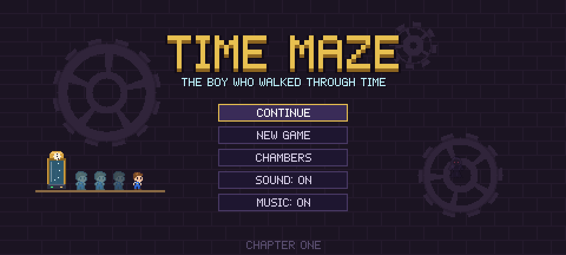
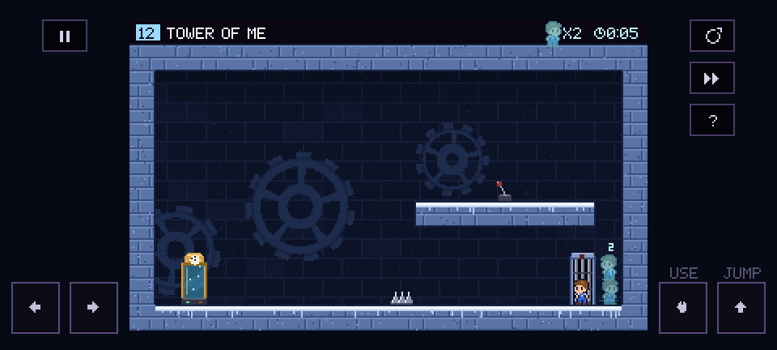
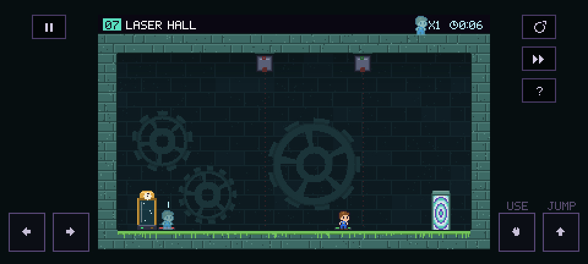
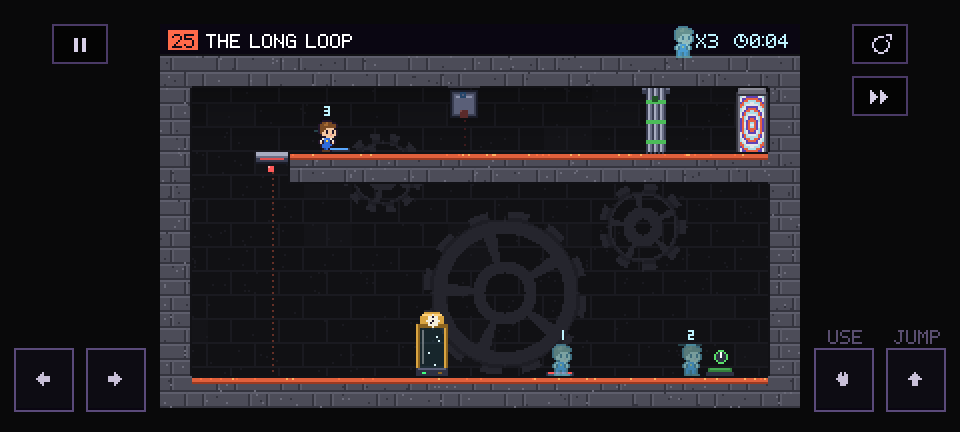
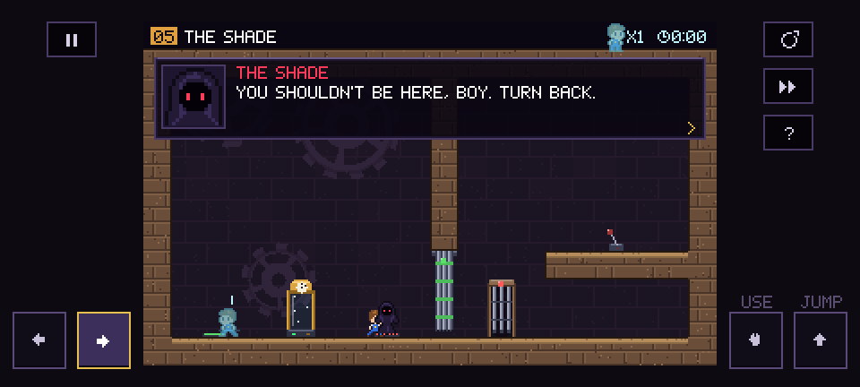

<p align="center"></p>

# Time Maze

*The boy who walked through time.* A pixel-art puzzle platformer for **Android, iPhone, iPad and the web**, in the spirit of **Chronotron** and **Braid**.

Milo, a boy in blue overalls, is trapped in a maze made of time. Each of the **20 chambers** is sealed by a puzzle, and every chamber holds a **time machine**. Step inside, press the button, and you're sent back to the moment you arrived. Your previous run stays behind as a **remnant**, a ghostly copy of you that repeats everything you did. You solve each chamber by working together with your own past selves.



## Download and play

All platforms run the same game code (`app/src/main/java/com/timemaze/game/core`), so levels, saves and story are identical everywhere.

### Android

- **APK:** [`dist/TimeMaze.apk`](dist/TimeMaze.apk), or the newest `TimeMaze.apk` on the **Releases** page. Copy it to your phone and open it. Android will ask you to allow installs from this source.
- Requires Android 5.0 (API 21) or newer. The APK is about 90 KB: every sprite, tile, sound and song is generated in code.

### iPhone and iPad

**Play in Safari (easiest, no App Store needed).** The web version is published on GitHub Pages at `https://loucifaitouakli85.github.io/<repository name>/`. The address follows the repository's name, for example `.../time-maze/`. Open it in Safari, tap **Share → Add to Home Screen**, and Time Maze gets its own icon and runs fullscreen, offline, with saved progress. To turn the site on, go to **Settings → Pages → Source: GitHub Actions** once; every push to the default branch then republishes it.

**Native iOS app.** `ios/` holds a small Swift app that bundles the same game. Building it needs a Mac with Xcode:

```bash
scripts/prepare-ios.sh                      # builds the web game into ios/TimeMaze/www
brew install xcodegen
cd ios && xcodegen generate && open TimeMaze.xcodeproj
```

Pick your team under *Signing & Capabilities* and press Run to install it on your iPhone. A free Apple ID works for your own device. Publishing on the App Store needs an Apple Developer account. Each build on GitHub Actions also produces `TimeMaze-unsigned.ipa`, which sideloading tools such as AltStore or Sideloadly can sign with your Apple ID.

### Computer

The web version also plays in desktop browsers with the keyboard or a gamepad. To run it locally: `scripts/build-web.sh`, then `python3 -m http.server -d web/target/webapp 8000`.

## How to play

| Touch | Keyboard / gamepad | What it does |
|---|---|---|
| ◀ ▶ (left side) | ← → / A D / D-pad | Walk |
| ⬆ JUMP (right side) | Space, Z, W / (A) | Jump. Hold for a higher jump |
| ✋ USE (right side) | X, E, S / (X) | Pull levers, or start the time machine while standing in it |
| ↺ | R / (Y) | Restart the current loop |
| ⏩ | F / (R1) | Fast-forward while you wait |
| ⏸ / Back | Esc | Pause: restart loop, erase remnants, chamber select |

**The rules of time**

- **Remnants** replay your old loops exactly. They press plates, pull levers, ride lifts, and you can stand on their heads.
- **Paradox:** if a remnant can't do what it did before (a gate now blocks it, the floor it stood on is gone, or a laser now hits it), time breaks and the loop restarts. Your remnants are kept.
- **Plates** stay active while someone stands on them. **Timed buttons** stay active for a few seconds after each press. **Levers** toggle.
- **Gates, lifts, lasers and exit doors** show coloured studs for the plates or levers that control them. A hollow stud means the mechanism works in reverse.
- The **Shade** lives outside of time. Whatever he breaks stays broken, no matter how many times you rewind.

## The chambers

| Zone | Chambers |
|---|---|
| **The Clockwork Halls** | 1 Awakening · 2 Echoes · 3 Two Places at Once · 4 Stepping Stone · 5 **The Shade** |
| **The Sunken Hours** | 6 Rising Tide · 7 Laser Hall · 8 Split Second · 9 The Bridge · 10 **The Shade Returns** |
| **The Frozen Seconds** | 11 Toggle · 12 Tower of Me · 13 Leap of Faith · 14 Counterweight · 15 **The Hunt** |
| **The Heart of Time** | 16 Inversion · 17 Skyward · 18 The Long Loop · 19 **The Truth** · 20 The Heart of Time |

The mechanics build up gradually: holding a plate with a remnant, two remnants at once, stacking remnants, lifts, lasers, timed buttons, toggling levers, towers of remnants, launching off a jumping remnant, inverted mechanisms, and finally a three-remnant relay. Each zone has its own palette and music.

The Shade first sabotages Milo in chamber 5 and returns three more times: in 10 he caves in the easy route, in 15 he hunts Milo through every loop, and in 19...

<details>
<summary><b>Story spoilers (the twist and the ending)</b></summary>

In chamber 19 the Shade drops his hood. He is Milo, sixty years older, still wearing the faded blue overalls. The maze isn't a prison, it's a lock, and Milo is its key. When old Milo opened the last door decades ago, time broke: cities froze mid-breath and people shattered into echoes. Every act of sabotage was an attempt to stop his younger self from repeating that catastrophe. His final act is to tear the core out of the time machine, leaving only two trips.

The ending is a cliffhanger. The Heart of Time cracks. Old Milo starts to warn the boy that the remnants "aren't echoes, they're..." and is erased mid-word. The sky splits into a thousand clock faces, remnants of Milo pour out of every crack in time, and on a rooftop a red-hooded stranger with golden eyes (the voice that lured Milo into the maze) thanks him: *"Now... the real maze begins."* **To be continued in Time Maze II: The Unraveling.**
</details>

## Screenshots

| | |
|---|---|
|  |  |
|  |  |

## Building

The game is plain Java with no third-party libraries.

**Android Studio / Gradle** (needs the Android SDK and JDK 17):

```bash
./gradlew testDebugUnitTest   # the bot solves all 20 chambers
./gradlew assembleRelease     # app/build/outputs/apk/release/app-release.apk
```

**Without the Android SDK** (Debian/Ubuntu packages only):

```bash
sudo apt install aapt apksigner zipalign dalvik-exchange android-sdk-platform-23
./scripts/build-apk-local.sh  # dist/TimeMaze.apk
```

**Web** (JDK 11+ and Maven): `scripts/build-web.sh` compiles the game to JavaScript with [TeaVM](https://teavm.org) into `web/target/webapp`.

**iOS:** see *iPhone and iPad* above.

Both Android builds sign with the key in `keystore/`. It's a public debug key, so APKs from either build can update each other. Generate your own key before publishing to a store.

## How it's made

```
app/src/main/java/com/timemaze/game/
├── MainActivity, GameView, AudioOut, PrefsStorage   Android host: window, 60 Hz loop, touch/keys, audio thread, saves
└── core/                                            platform-independent game, shared by every platform
    ├── World        physics, loop recording and replay, paradox detection, mechanisms, the Shade
    ├── Levels       the 20 chambers as ASCII maps plus wiring, hints and Shade scripts
    ├── Game         screens, HUD, touch controls, cutscenes, save data
    ├── Renderer     draws a chamber into a 320x176 pixel framebuffer
    ├── Story        intro and ending scenes
    ├── Sprites/Font hand-made pixel art and a 5x7 pixel font, defined in code
    └── Audio/Sfx    software synth: chiptune music per zone and all sound effects
web/    browser host (WebMain.java + host.js): canvas, multi-touch, keyboard, gamepads, Web Audio, offline PWA
ios/    Swift app (XcodeGen project) that shows the web build fullscreen in a WKWebView
```

The game draws into a small pixel buffer that the phone scales up with nearest-neighbour filtering, so the pixels stay crisp on any screen. Remnants replay recorded positions frame by frame. A paradox is detected when a replayed remnant overlaps something solid, loses the support it had, or touches a hazard.

The unit tests in `app/src/test` include a scripted bot that plays every chamber with the real physics. It proves each puzzle can be solved, that the par remnant counts are right, that the Shade appears where he should, and that the key puzzles can't be skipped.

Desktop-only helpers (screenshots, icon generation, a solution report) live in `tools/` because they use `java.awt`. Run them with `scripts/dev-tools.sh`, for example `scripts/dev-tools.sh SolveAll`.
